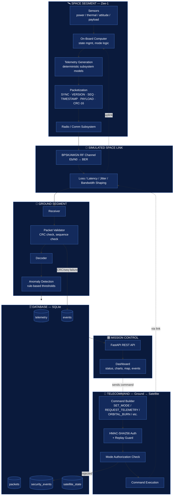

<div align="center">


# ZEE-1
### Satellite Telemetry Simulator v.1.0

_An educational, end-to-end simulation of a fictional **Zee-1** CubeSat and its_
_mission-control ground station._

<br/>


<br/>

*Every number on screen comes from a documented, deterministic model — never*
*from a roll of the dice. Telemetry, noise, loss and corruption are all*
***physics you can read about.***

> 🛰️ **Zee-1 is a fictional satellite.** This project is for learning, not real
> mission operations.

</div>

<br/>

---

## 🗺️ Contents

| Section | What you'll find |
| :-- | :-- |
| [✨ Key findings](#-key-findings) | What this simulation proves, and what you can observe in it |
| [🔭 What it demonstrates](#-what-it-demonstrates) | The five layers of the simulator, from space segment to operations |
| [🌌 System flow](#-system-flow) | End-to-end data flow, from sensors to dashboard |
| [🚀 Quickstart](#-quickstart) | Run with Docker or natively, plus API authentication |
| [📡 Telecommands](#-telecommands) | Every uplink command the ground station can send |
| [📶 Physical link model](#-physical-link-model-why-packets-get-corrupted) | The BPSK/AWGN math behind bit errors |
| [🧭 Project layout](#-project-layout) | Where each part of the codebase lives |
| [🧪 Testing & Documentation](#-testing--documentation) | Run the test suite and read the deep-dives |

---

## 📸 Mission Control, live

<p align="center">
  
  <br>
  <sub><em>A complete spacecraft &amp; link readout — every subsystem (EPS, OBC, ADCS, thermal)<br/>
  and the physical link can be watched and reasoned about live.</em></sub>
</p>

<br/>

<p align="center">
  
  <br>
  <sub><em>Orbit matters: telemetry only arrives during the Kuching pass, and trends<br/>
  show how spacecraft state evolves between passes.</em></sub>
</p>

<br/>

<p align="center">
  
  <br>
  <sub><em>Security &amp; noise you can touch — auth, replay and mode gates, plus injecting<br/>
  link loss/corruption and watching the chat tester degrade.</em></sub>
</p>

---

## ✨ Key findings

What running this simulation actually demonstrates:

| # | Finding |
| :-: | :-- |
| 1 | **Corruption is physics, not luck** — bit errors track the BPSK/AWGN theory curve (`BER = 0.5·erfc(√(Eb/N0))`). At ~10 dB the link is essentially clean; near 0 dB it falls apart. You can reproduce the textbook curve live. |
| 2 | **The link is the weakest — and most teachable — link** — latency, packet loss and bandwidth shaping visibly degrade delivery; corrupted frames are caught by CRC-16; delivery recovers as soon as conditions allow. |
| 3 | **Commands are secure by construction** — every uplink is checked for structure, HMAC auth, replay, and mode authorization *before* it can touch the spacecraft, so a bad, forged or out-of-mode order never executes. |
| 4 | **Orbital mechanics are real** — an `ORBITAL_BURN` changes altitude and period per the vis-viva equation (a larger orbit is a *slower* one), which shifts pass timing; `ADJUST_ATTITUDE` changes how much sunlight hits the bus. |
| 5 | **Everything is auditable end-to-end** — every frame, error, command and anomaly lands in a queryable event log, so cause → effect is always traceable. |

---

## 🔭 What it demonstrates

<table>
<tr><td width="40" align="center">🛰️</td><td><b>Space segment</b><br/>Subsystem models (EPS, OBC, ADCS, thermal, payload), safety modes, orbit propagation and ground-track over a single ground site.</td></tr>
<tr><td align="center">📶</td><td><b>Link physics</b><br/>Data is pushed through a real <b>BPSK-over-AWGN</b> model. Errors come from the signal-to-noise ratio (<code>Eb/N0</code>), not dice rolls. Add latency, packet loss and bandwidth shaping to taste.</td></tr>
<tr><td align="center">📡</td><td><b>Ground segment</b><br/>Frame sync, CRC-16 validation, telemetry decoding, sequential-packet anomaly detection, SQLite persistence.</td></tr>
<tr><td align="center">🔐</td><td><b>Telecommand uplink</b><br/>HMAC-SHA256 authenticated commands with mode-aware authorization and replay protection.</td></tr>
<tr><td align="center">🎛️</td><td><b>Operations</b><br/>A live mission-control dashboard plus a REST API to drive it: change modes, inject faults, degrade the link, fire orbit burns, and even send a chat message through the noisy link.</td></tr>
</table>

---

## 🌌 System flow

End-to-end data flow, from sensors on the spacecraft to the mission-control
dashboard — including the reverse telecommand path.



**⬇ Downlink (telemetry):** sensors → OBC → packetization → RF/AWGN link (with
configurable loss/latency) → ground receiver → CRC/sequence validation →
decode → anomaly check → SQLite → API → dashboard.

**⬆ Uplink (telecommand):** dashboard/API issues a command → HMAC auth + replay
check → mode-authorization gate → only then does it reach the OBC through the
same noisy link. Failures at validation or auth/authorization are logged to
`events` / `security_events`, which feed the dashboard's event log.

---

## 🚀 Quickstart

### With Docker <sub>(recommended)</sub>

```bash
docker compose up --build -d
```

Then open <http://127.0.0.1:8000/>.

> 💾 `data/` is bind-mounted, so the SQLite database survives container restarts.
> Use **Reset** on the dashboard (or delete `data/telemetry.db`) to start a
> clean mission.

### Without Docker <sub>(native Python)</sub>

```powershell
py -m venv .venv
.\.venv\Scripts\python.exe -m pip install -r requirements.txt
Copy-Item .env.example .env        # optional: edit your secrets
.\.venv\Scripts\python.exe -m uvicorn mission_control.api:app --host 127.0.0.1 --port 8000
```

Open <http://127.0.0.1:8000/>.

### 🔑 Authentication

API endpoints require an `X-API-Token` header. The dashboard fetches its own
token server-side. Set real secrets in `.env` before anything beyond local
learning:

```dotenv
API_TOKEN=your-long-secret-token
SATELLITE_COMMAND_SECRET=another-long-secret-token
```

---

## 📡 Telecommands

Spacecraft-side commands are validated (structure), authenticated (HMAC),
replay-checked and mode-authorized *before* execution.

| Command | Parameters | Effect |
| :-- | :-- | :-- |
| `SET_MODE` | `mode` | Switch operating mode (BOOT/INIT/SAFE/NORMAL/…) |
| `REQUEST_TELEMETRY` | — | Queue an immediate telemetry downlink |
| `START_PAYLOAD` | — | Activate payload → `PAYLOAD_OPERATION` |
| `STOP_PAYLOAD` | — | Return to `NORMAL` |
| `ORBITAL_BURN` | `delta_v_mps` (±200) | Along-track ΔV: **+ raises** the orbit (passes come later), **− lowers** it (passes come sooner) |
| `ADJUST_ATTITUDE` | `attitude` | `NADIR`, `SUN_POINTING` (full sun), `INERTIAL` |

The dashboard also has a **chat / message link tester**: send text
ground↔satellite through the real lossy link and watch delivered / corrupted /
lost chunks and the reconstructed message.

---

## 📶 Physical link model <sub>(why packets get corrupted)</sub>

The link uses **BPSK modulation over an AWGN channel**. The bit error rate is
computed from the link budget:

```
BER = 0.5 * erfc(sqrt(Eb/N0_linear))
```

| Eb/N0 | BER | Link behaviour |
| :-: | :-: | :-- |
| 0 dB | ≈ 7.9e-2 | 🔴 heavily corrupted |
| 10 dB | ≈ 4e-6 | 🟢 essentially clean |

`link_quality_percent = clamp(Eb/N0 / 15 * 100)`. Corruption is *physics*, not
a roll of the dice. See [`docs/communication.md`](docs/communication.md) for
the full write-up.

---

## 🧭 Project layout

```
config.py               Simulation configuration (env-driven, no secrets in code)
satellite/              Spacecraft models: orbit, modes, subsystems, storage, telemetry
communication/          SpaceLink (loss/latency/bandwidth), RF channel, visibility, chat
ground_station/         Receiver, validator, decoder, anomaly rules, station gateway
security/               Command registry, HMAC auth, replay guard
simulation/             Engine: events, faults, anomaly, runner
telemetry/              Schema, CRC-16, packet framing
database/               SQLite store
mission_control/        FastAPI + dashboard (mission_control/web)
tests/                  pytest suite
docs/                   In-depth explanation of the models
```

---

## 🧪 Testing & Documentation

```powershell
.\.venv\Scripts\python.exe -m pytest tests -q
```

The suite covers the RF channel physics, the chat tester, and the orbital
burn / attitude telecommands — **47 tests passing**. ✅

- 📘 [`docs/architecture.md`](docs/architecture.md) — system design and data flow
- 📘 [`docs/communication.md`](docs/communication.md) — RF/BPSK link model in detail

---

<div align="center">

⋆｡°✩ *Zee-1 is a fictional educational CubeSat simulator. Not a real satellite.* ⋆｡°✩

</div>
