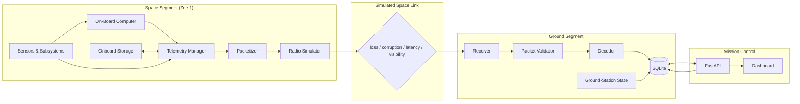
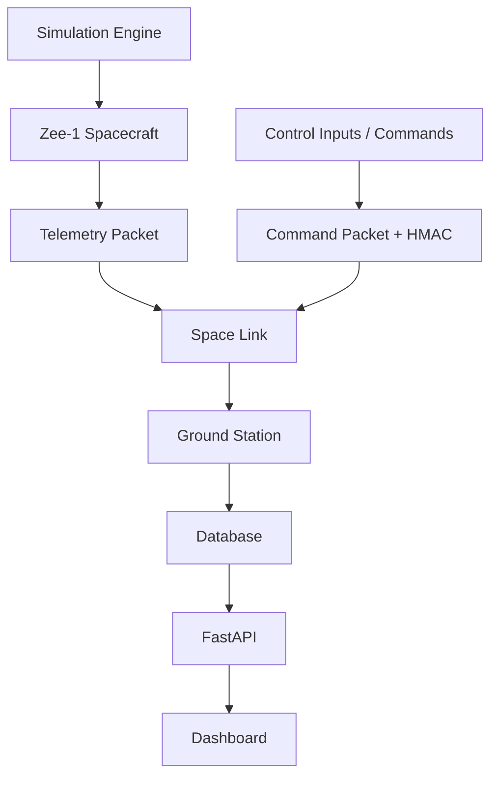

# Satellite Telemetry Simulator — System Architecture

> **Educational simulator.** Zee-1 is a fictional CubeSat used to study
> spacecraft telemetry, packetized communication, ground systems, and mission
> security. It is **not** a real satellite and must not be used for real mission
> operations.

---

## 1. Mission Concept

Zee-1 is a simulated 1U/3U-class CubeSat in a low-Earth orbit (LEO). The
mission exists to demonstrate, end to end, the software and networking
architecture that underpins a real spacecraft mission:

1. Onboard subsystems produce state (power, thermal, computing, attitude).
2. A telemetry manager turns subsystem state into structured telemetry frames.
3. A packetizer wraps frames in a binary packet with sync, version, IDs,
   sequence numbers, and a CRC integrity check.
4. A simulated space link applies realistic radio-channel effects: packet loss,
   corruption, latency, jitter, and ground-station visibility.
5. A ground station receives, validates, decodes, and stores the telemetry.
6. A mission-control API and dashboard present the live spacecraft state and
   historical trends.
7. A ground-to-space **telecommand** path (with HMAC authentication and replay
   protection) demonstrates the command uplink and its security requirements.

The pedagogical focus is on **telemetry, communications, networking, ground
systems, and cybersecurity**, not on high-fidelity orbital physics or RF
engineering. Each subsystem is a faithful *conceptual* model of its real
counterpart, simplified deliberately and documented as such.

---

## 2. System Components

| Component            | Module                | Responsibility                                                        |
| -------------------- | --------------------- | --------------------------------------------------------------------- |
| Simulated CubeSat    | `satellite/`          | Subsystem state, operating modes, onboard storage, list & act         |
| Telemetry            | `telemetry/`          | Telemetry schema, deterministic value models, packet build/parse      |
| Communication link   | `communication/`      | Simulated space channel: loss, corruption, latency, jitter, visibility|
| Ground station       | `ground_station/`     | Receiver, validator, decoder, contact/state tracking                  |
| Database             | `database/`           | SQLite persistence: telemetry, packets, events, security, satellite   |
| Mission control      | `mission_control/`    | FastAPI backend + REST API for dashboard                              |
| Dashboard            | `mission_control/web/`| Browser UI (HTML/CSS/JS + Chart.js)                                   |
| Security             | `security/`           | Command auth (HMAC-SHA256), replay protection, security events        |
| Simulation           | `simulation/`         | Fault injection, orchestration, time model                            |
| Tests                | `tests/`              | Unit, integration, and failure-injection tests                        |

---

## 3. Data Flow

```
                     SPACE SEGMENT
  ┌───────────────────────────────────────────────┐
  │  EPS ──▶ OBC ──▶ TELEMETRY MANAGER            │
  │  ADCS ───▶ │ ──▶ TELEMETRY GENERATOR          │
  │  THERMAL ─▶ │      │                          │
  │  PAYLOAD ─▶ │      ▼                          │
  │  COMMS ────▶ │   PACKETIZER                   │
  │              │      │  (binary frame + CRC)   │
  │           ONBOARD STORAGE (store & forward)   │
  └────────────────────────┬──────────────────────┘
                           │  simulated space link
                           │  (loss / corruption / latency / visibility)
                             ▼
                     GROUND SEGMENT
  ┌───────────────────────────────────────────────┐
  │  RECEIVER ──▶ PACKET VALIDATOR ──▶ DECODER    │
  │                   │  (CRC, seq gaps)           │
  │                   ▼                           │
  │              GROUND-STATION STATE             │
  │                   │                           │
  │                   ▼                           │
  │              SQLITE DATABASE                  │
  │                   │                           │
  │                   ▼                           │
  │            MISSION-CONTROL API                │
  │                   │                           │
  │                   ▼                           │
  │            DASHBOARD (charts + status)        │
  └───────────────────────────────────────────────┘
```

The uplink path (Phase 15+) flows in reverse: dashboard/API → command packet →
HMAC + replay check → decryption of intent → command execution on the
simulated spacecraft.



---

## 4. Satellite Segment (Space Segment)

The simulated CubeSat is a collection of **logical subsystems**, each modeled as
a component that mutates shared spacecraft state each simulation tick:

- **EPS** — Electrical Power System. Battery charge/discharge, solar generation
  vs. power consumption, battery voltage from a modeled discharge curve.
- **OBC** — On-Board Computer. CPU/memory/storage usage driven by operating mode.
- **ADCS** — Attitude Determination & Control. Roll/pitch/yaw with gradual drift.
- **Thermal** — Bus temperature with thermal inertia, influenced by operations
  and attenuated solar illumination.
- **Communications subsystem** — radio behavior: transmit state, contact state.
- **Payload** — mission equipment; active only during `PAYLOAD_OPERATION`,
  drives CPU/power load.
- **Telemetry manager** — central data path: samples subsystems, produces
  telemetry, delegates to the packetizer, buffers offline telemetry onboard.

The spacecraft runs a **finite state machine** over operating modes
(`BOOT → INIT → SAFE → NORMAL → PAYLOAD_OPERATION → COMMUNICATION`) with
documented, validated transitions. Any critical fault drives the spacecraft to
`SAFE` mode (payload disabled, power reduced, communications maintained).

---

## 5. Ground Segment

The ground station is the interface between the simulated radio channel and the
rest of the ground network. Its responsibilities:

1. **Receive** raw bytes from the link layer.
2. **Validate** frame structure (sync, version, satellite ID, payload length,
   CRC-16 integrity).
3. **Track** sequence numbers and detect gaps (missing packets).
4. **Decode** validated payloads into telemetry records.
5. **Record** reception timing and compute communication statistics
   (received/lost/corrupted/rejected, current data rate, estimated link quality).
6. **Persist** telemetry, packet records, events, and security events to SQLite.
7. **Never blindly trust** the channel: corrupt or malformed packets are
   rejected and counted, not silently accepted.

The ground station also owns the **uplink gateway**: commands are validated,
authenticated, and forwarded to the spacecraft over the same simulated link.

---

## 6. Communication Link

A simulated space channel sits between the satellite and ground station. It
models the impairments a real RF link introduces:

- **Packet loss** — configured probability of a packet never arriving.
- **Packet corruption** — configured probability of bit errors in transit
  (detected by CRC mismatch at the validator).
- **Latency** — one-way delay per packet (base + jitter).
- **Jitter** — random variation around the base latency.
- **Bandwidth / data-rate limit** — throttle on bytes delivered per second.
- **Visibility / pass** — when the satellite is below the ground station's
  minimum elevation, no packets are delivered in either direction.

All parameters are configurable via environment variables or the simulation
configuration, never hard-coded. The channel reports statistics to the ground
station so hardware-in-the-loop comparisons can be made later.

---

## 7. Database

SQLite in the first version (zero configuration, file-based, ACID, good enough
for an educational single-instance deployment).

Tables:

| Table            | Contents                                                    |
| ---------------- | ----------------------------------------------------------- |
| `telemetry`      | Decoded telemetry records (one row per accepted packet)     |
| `packets`        | Raw packet metadata: seq, type, size, CRC validity, status  |
| `events`         | Mission events (mode changes, fades, faults, contacts)      |
| `security_events`| Security-relevant events (auth failure, replay, etc.)       |
| `satellite_state`| Latest snapshot of spacecraft state                         |

Indexes are placed on the hot query paths: timestamp ranges, sequence numbers,
and event ordering. A future PostgreSQL migration (< 100 lines of SQL) is a
documented roadmap item.

---

## 8. Dashboard

A browser-based mission-control interface, served by the FastAPI app. It shows:

- **Spacecraft status** panel: satellite ID, mode, comm state, mission time.
- **Power / Thermal / Computing** gauges.
- **Position** panel (from the orbit model) and a simple world-map tracing of the
  ground track.
- **Communication** panel: packets received/lost, CRC errors, latency, data rate,
  link quality, visibility state.
- **Trend charts** (Chart.js, auto-refreshing): temperature, battery, solar
  power, CPU, memory, altitude.
- **Events** feed and **security events** feed.

The dashboard is a consumer of the API; it holds no business logic.

---

## 9. Security Boundary

The security model treats the space link as an **untrusted medium**:

```
   Satellite ──────[ UNTRUSTED: lossy, corrupting, adversarial ]────── Ground Station
                                 │
                                 ▼
              Authentication (HMAC-SHA256)
              Integrity (CRC-16 + HMAC for commands)
              Replay protection (command sequence numbers)
              Authorization (mode-aware command policy)
              Validation (schema + satellite ID checks)
              Security event logging
```

- **Telemetry (downlink):** integrity via CRC-16 (error detection, *not*
  authentication). A compromised channel can tamper with telemetry; this is a
  documented residual risk and the subject of the anomaly detector.
- **Telecommands (uplink):** authenticated with HMAC-SHA256 using a shared
  secret, plus a sequence number to defeat replay. Authorization is enforced by
  the spacecraft's mode-aware command policy. Supported commands: `SET_MODE`,
  `REQUEST_TELEMETRY`, `START/STOP_PAYLOAD`, `ORBITAL_BURN` (along-track
  ΔV that raises/lowers the orbit and shifts future pass times over the
  station), and `ADJUST_ATTITUDE` (`NADIR` / `SUN_POINTING` / `INERTIAL`,
  which changes how much sunlight the panels collect).
- **Encryption** (AES-GCM) is a documented, later-stage upgrade.
- The API is protected by a simple bearer-token scheme for dashboard access;
  the simulation is intended for localhost only.

Every security event (failed auth, replay, invalid command, unexpected mode
transition, suspicious telemetry) is written to `security_events`.

---

## 10. Design Principles

- **Incremental build.** Each major subsystem is added in sequence, with its own
  documentation and tests. See `docs/development.md` for the phase log.
- **Deterministic simulation.** Telemetry comes from *models* with documented
  dynamics (charge/discharge rates, thermal inertia, load profiles), not from
  independent random draws. Randomness is limited to channel impairments and
  sensor noise, and is seeded for reproducibility.
- **Correct terminology.** The simulator distinguishes simulation,
  approximation, and real spacecraft engineering, and uses the terms telemetry,
  telecommand, tracking, attitude, orbit, payload, OBC, EPS, ADCS, and TT&C
  correctly.
- **Security-conscious defaults.** No secrets in code; shared secrets come from
  environment variables; `.env` is never committed.
- **No fake control.** The dashboard is a monitor, not a spacecraft control
  surface. Command handling is explicit, validated, and auditable.


