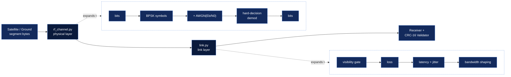

# 📶 Communication Model <sub>(downlink & uplink)</sub>

> This document explains how packets travel between the satellite and the
> ground station, including the **physical RF channel** that makes corruption
> emerge from noise rather than from a dice roll.

---

## 🗺️ Contents

| Section | What you'll find |
| :-- | :-- |
| [🔗 The chain](#-the-chain) | How a bit gets from OBC to ground station, layer by layer |
| [📡 Physical layer: BPSK over AWGN](#-physical-layer-bpsk-over-awgn) | The modulation math and the BER table |
| [🎚️ Key knobs](#️-key-knobs-config--env) | Config values that control the link budget |
| [🌊 Link layer](#-link-layer) | Loss, latency, jitter, bandwidth shaping, visibility |
| [🧾 What a CRC failure tells you](#-what-a-crc-failure-tells-you) | Reading corrupted vs. missing vs. lost |
| [🧪 Example: live link-budget collapse](#-example-live-link-budget-collapse) | Reproduce the theory curve yourself |

---

## 🔗 The chain



The **spacecraft-side bits** pass through the RF channel first (`rf_channel.py` —
the new physical-layer model), then through the link layer (`link.py` —
visibility, loss, latency, bandwidth), and finally arrive at the receiver +
CRC-16 validator on the other end (ground station for downlink, spacecraft for
uplink).

---

## 📡 Physical layer: BPSK over AWGN

Modulation is coherent BPSK with unit symbol energy (`Es = 1`, hence `Eb = 1`
for BPSK — 1 bit per symbol, no coding). Noise is additive white Gaussian, so a
received symbol is:

```
r = s + n ,   n ~ N(0, σ²)
```

Per-dimension noise power:

```
σ = sqrt(N0 / 2),   N0 = Eb / 10^(Eb/N0_dB / 10)
```

A hard-decision demapper decides `sgn(r)`. The theoretical bit-error rate is:

```
BER = 0.5 * erfc(sqrt(Eb/N0))
```

| Eb/N0 (dB) | Theoretical BER | Rule of thumb |
| :-: | :-: | :-- |
| 0  | 7.9e-2 | 🔴 link unusable |
| 4  | 1.3e-2 | 🔴 failing link |
| 6  | 2.4e-3 | 🟠 marginal |
| 8  | 1.9e-4 | 🟡 poor |
| 10 | 3.9e-6 | 🟢 good (default) |
| 12 | 9.0e-9 | 🟢 excellent |

The "required Eb/N0 for BER 1e-5" is computed by inverting the formula
(≈ 9.6 dB for BPSK) and surfaced in the API/dashboard.

---

## 🎚️ Key knobs <sub>(config / .env)</sub>

| Variable | Default | Effect |
| :-- | :-- | :-- |
| `LINK_EB_N0_DB` | `10` | The link budget in dB. Lower it live via `POST /api/link/eb_n0` (or the dashboard control) to degrade the link and watch CRC failures accumulate at the ground station. |
| `PACKET_CORRUPTION_RATE` | `0` (physics only) | *Interference bursts* layered on top of the AWGN. Represents jamming/co-channel interference; each burst flips ~3% of the packet's bits, guaranteeing a CRC failure. |
| `PACKET_CORRUPTION` fault | — | Forces an interference burst on every packet. |

### Behavior with corruption

Every packet crosses the modulator + AWGN channel once, on the transmit side.
If any bit flips, the packet is counted as corrupted and delivered with the
physical bit errors intact. The receiver therefore fails the CRC-16 check for
a *physically* plausible reason — not a synthetic dice roll.

---

## 🌊 Link layer

On top of the RF channel, the link still applies the classic impairments:

- **Visibility gate** — no traffic in either direction below the elevation mask.
- **Packet loss** — probability `PACKET_LOSS_RATE` (plus the `PACKET_LOSS`
  fault); counted as lost, never delivered.
- **Latency + jitter** — delivery scheduled at `base + U(0, jitter)` ms.
- **Bandwidth shaping** — `LINK_BANDWIDTH_BPS` bytes/sec budget delays packets
  while the instantaneous rate is exceeded.

---

## 🧾 What a CRC failure tells you

Because the link layer and RF channel are separated, the ground station
distinguishes three distinct failure modes:

| Counter | Meaning |
| :-- | :-- |
| `packets_corrupted` | Frames that arrived but failed CRC (visible noise) |
| `packets_missing` | Sequence gaps left by lost/corrupted frames |
| `packets_lost` | Frames the link dropped outright |

---

## 🧪 Example: live link-budget collapse

1. Run the dashboard with the default `Eb/N0 = 10 dB`. Data gets through cleanly.
2. Drop `LINK_EB_N0_DB` to `3` via the environment (or the API) mid-pass.
3. The measured BER climbs toward the theoretical value (~2.3e-2), the ground
   station starts reporting CRC failures, and `missing`/`packets_rejected`
   counters rise as validation rejects the noisy frames.

---

## See also

- [`../README.md`](../README.md) — project overview, quickstart, and the
  reader-facing system-flow diagram
- [`architecture.md`](architecture.md) — full system architecture and data flow
- [`security.md`](security.md) — threat model and command-authentication design
